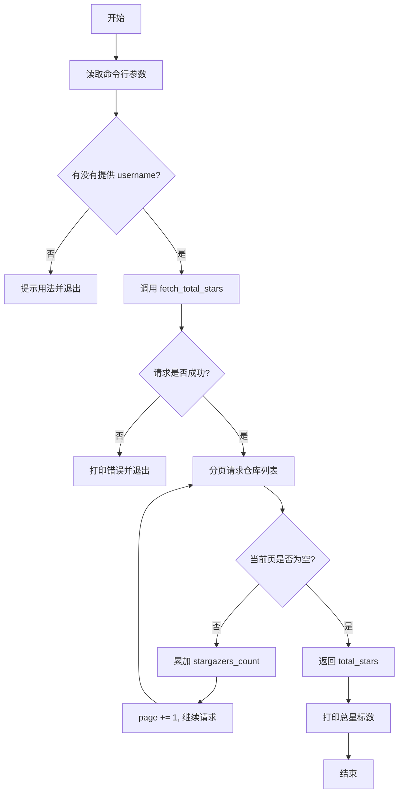

# GitHub Stars Script Flowchart



# fetch_total_stars Detailed Flowchart

```mermaid
flowchart TD
    A[进入 fetch_total_stars] --> B[初始化 headers / total_stars / page]
    B --> C["发送 GET 请求 /users/<username>/repos"]
    C --> D{status == 404?}
    D -- 是 --> E[抛出 User not found]
    D -- 否 --> F{status 403 且 X-RateLimit-Remaining 为 0?}
    F -- 是 --> G[计算 reset_time]
    G --> H{reset_time 存在?}
    H -- 是 --> I[抛出限流错误并带时间]
    H -- 否 --> J[抛出限流错误]
    F -- 否 --> K[resp.raise_for_status]
    K --> L[repos = resp.json]
    L --> M{repos 为空?}
    M -- 是 --> N[返回 total_stars]
    M -- 否 --> O[遍历 repos 累加 stargazers_count]
    O --> P[page += 1; sleep(0.1)]
    P --> C
```

